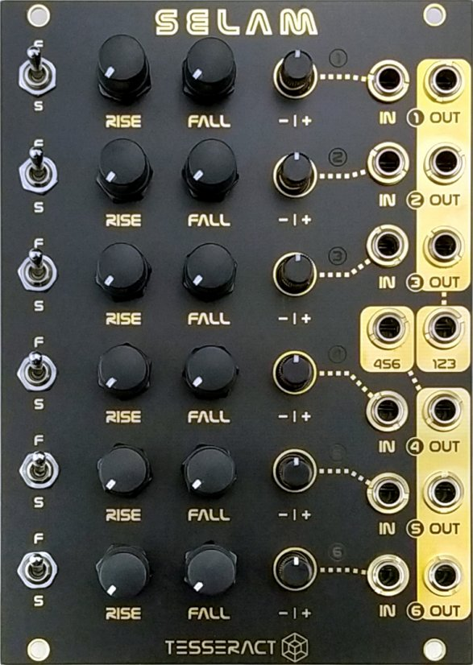

## Historical Context

The slope generator is one of the oldest ideas in synthesis, and one of the most misunderstood. In most educational contexts, an envelope generator, a low-frequency oscillator, and a slew limiter are introduced as three separate tools with three separate purposes. They are not. They are the same circuit operating at different speeds.

Don Buchla understood this when he designed the 281 Quad Function Generator for the Buchla 200 series in 1970. A function generator produces a voltage that rises to a peak, then falls: attack and decay, nothing more. Trigger it with a gate and it becomes an envelope. Run it freely and it becomes an LFO. Feed it a stepped voltage and it smooths the steps into curves; this is slew limiting (also called lag processing). The circuit does not change. Only the input signal and the time constants differ.

Serge Tcherepnin arrived at the same insight from a different direction. Working in the San Francisco Bay Area from 1973, Tcherepnin designed the Serge Modular system as a low-cost, DIY-friendly alternative to the Moog and Buchla instruments of the time. His Dual Universal Slope Generator (DUSG) became one of the most studied circuits in synthesis history. "Universal" was the operative word: the same module served as envelope, LFO, slew limiter, and at audio frequencies an oscillator. Tcherepnin distributed the designs through community networks and as DIY kits, and the DUSG became foundational to the West Coast synthesis tradition.

In Eurorack, the slope generator lineage continues most visibly in Make Noise's Maths (approximately 2010), which drew directly on the DUSG concept and introduced it to a new generation of players. Most Eurorack slope generators are dual: two channels, paired but independent. Six channels is unusual.

Tesseract Modular, founded by Sinisa Kekez and Mangu Díaz in Seville in 2019, designs modules as DIY kits: schematics and bills of materials are published alongside the finished product. The Selam carries both that open ethos and the slope generator tradition forward in a specific direction. Six channels, per-channel attenuverters with polarity control, and two group mix outputs that sum three channels each. The architecture reflects what slope generators are for in practice: not individual modulation sources used one at a time, but systems that generate relationships between signals. Six channels with two mix buses is a different proposition than three dual slope generators. The mix buses make those relationships audible and usable without additional modules.

## Quick Start

1. Leave all six input jacks unpatched. Set all six fast/slow switches to fast. Turn all attenuverters to center (center detent is zero output; the channels are producing signal internally but nothing reaches the output jacks).
2. Slowly turn channel 1's attenuverter clockwise past center. The bi-color LED begins cycling, indicating the channel is self-oscillating as a free-running LFO.
3. Patch channel 1's individual output to any CV destination: filter cutoff, VCA level, oscillator FM. The output is bipolar, approximately plus and minus 4.8 volts.
4. Adjust channel 1's Rise and Fall knobs. Rise sets the time the voltage takes to reach its peak; Fall sets the time it takes to return to minimum. Equal Rise and Fall produces a roughly triangular wave. Fast Rise with slow Fall produces a shape that snaps up and glides back down. Slow Rise with fast Fall produces the reverse.
5. Patch the Mix 1+2+3 output to a second CV destination. Turn channel 2 and channel 3 attenuverters clockwise past center. The mix output now carries the sum of three LFOs, each at a different rate depending on its Rise and Fall settings.
6. Turn channel 2's attenuverter counterclockwise past center instead. Channel 2 is now inverted: when channels 1 and 3 are rising, channel 2 is falling. The mix output carries a more complex, asymmetric shape than any single LFO could produce.
7. Switch channel 3's fast/slow toggle to slow. Its LFO period extends by a factor of approximately 80. The mix bus now combines fast and slow motion simultaneously. Adjust attenuverter positions while listening to the result rather than in advance.

## Key Specifications

| Specification | Value |
|---|---|
| Width | 18 HP |
| Depth | 35 mm |
| +12V Current | 159 mA |
| -12V Current | 153 mA |
| +5V Current | 0 mA |
| LFO Output Range | ±4.8V (bipolar) |
| Min Attack/Decay (fast mode) | 0.3 ms |
| Min Attack/Decay (slow mode) | 13 ms |
| Max Attack/Decay (fast mode) | ~13 seconds |
| Max Attack/Decay (slow mode) | ~3 minutes |
| Max LFO Period (fast mode) | ~1 second |
| Max LFO Period (slow mode) | ~1 minute 20 seconds |

**Power note:** 159 mA on the +12V rail and 153 mA on the -12V rail place the Selam among the highest-draw modules in a typical Eurorack system. Verify available headroom on both rails before installing. The -12V demand is particularly notable; many power supplies have asymmetric capacity with significantly less -12V headroom than +12V, and the Selam draws almost equally from both.

## Essential Parameters

**Rise and Fall (two knobs per channel, twelve total).** Rise sets the time the output voltage takes to ascend from its minimum to its peak. Fall sets the time it takes to descend from peak back to minimum. These are time controls, not rate controls: the effect depends on what mode the channel is in. In LFO mode (no input), Rise and Fall together determine the period and waveshape of the self-oscillating cycle. In envelope mode (gate or trigger input), Rise sets attack time and Fall sets decay and release time. In slew mode (CV input), Rise sets how quickly the output can follow an upward step in the incoming voltage, and Fall sets how quickly it can follow a downward step.

**Fast/Slow switch (one per channel, six total).** Each channel has a two-position toggle that shifts its entire time range. In fast mode the minimum attack or decay time is 0.3 milliseconds and the maximum LFO period is approximately one second. In slow mode the minimum rises to 13 milliseconds and the maximum LFO period extends to one minute and twenty seconds. Slow mode is appropriate for gradual modulation: atmospheric swells, CV that evolves over the course of a performance rather than a phrase, or envelope tails that sustain for many seconds. Combining fast and slow channels within the same mix bus produces CV with simultaneous fast and slow motion components: a modulation character that no single LFO can replicate.

**Input jack (one per channel, six total).** What is patched into the input determines what the channel does. Nothing patched: the channel self-oscillates as a free-running LFO. Gate or trigger patched: the channel becomes an AR envelope generator; the rising edge of the gate begins the attack phase, the gate remaining high sustains near the peak, and the gate falling begins the decay and release phase. Stepped or slowly moving CV patched: the channel acts as a slew limiter, smoothing abrupt voltage changes into gradual curves according to the Rise and Fall settings.

**Attenuverter (one per channel, six total).** Each channel has a dedicated attenuverter knob that scales the channel's output before it reaches both the individual channel output jack and the group mix bus. Center detent position is zero: no output, no contribution to the mix bus. Turning clockwise from center increases output in the positive direction. Turning counterclockwise from center increases output in the negative (inverted) direction. This is not an attenuverter where center is unity passthrough; center here is silence. If a channel is producing signal (LED cycling) but nothing is reaching the output or the mix bus, the attenuverter at center is the cause. Rotate in either direction to bring the channel into the circuit.

The polarity control is the Selam's most compositional feature. A channel set fully counterclockwise outputs the inverse of its slope: when the channel's LFO is rising, the inverted output is falling; when the envelope is attacking upward, the inverted version is pulling downward. Two channels within the same mix bus, one clockwise and one counterclockwise at equal amounts, produce a partially or fully canceling sum depending on their relative rates and phases. The result is CV that is neither fully positive nor fully negative at any moment: complex movement with no simple period and no predictable peak.

The workflow this implies is deliberate: set attenuverter positions after listening to the mix output rather than before. Visualize the result at the destination, then adjust which channels contribute and in which direction.

**Mix outputs (two jacks: Mix 1+2+3 and Mix 4+5+6).** These jacks sum the attenuverter-scaled outputs of their respective three channels. Each channel's contribution to the mix is determined entirely by its attenuverter position: center means no contribution, clockwise means positive contribution, counterclockwise means negative (inverted) contribution. The mix outputs are not alternatives to the individual channel outputs; both are always active simultaneously. Patching a channel's individual output to one destination does not remove that channel from the mix bus. One channel can drive an individual target and contribute to the mix bus at the same time.

## Why the Selam Excels

Most modulation problems in a patch require either multiple independent signals or a single complex signal. Six independent slope generators address the first need directly: different LFO rates for different targets, different envelope shapes for different voices, different slew amounts for different CV streams. The group mix buses address the second: the summed and attenuverter-scaled output of three channels is a complex signal that no single LFO or envelope can produce.

The polarity control on the attenuverter makes the mix buses compositional rather than simply additive. A mix of three LFOs moving in the same direction is a louder, phase-staggered LFO. A mix of LFOs with opposing polarities is CV that moves in ways that resist easy description: some channels pushing up while others pull down, the sum spending time near zero as channels cancel and near extremes as they briefly align. This is the difference between combining modulation sources and composing with them.

The fast/slow switch per channel is a genuine architectural decision. A single channel at one rate setting produces periodic modulation. A mix bus carrying one fast channel and one slow channel produces modulation with two simultaneous time scales: motion that is fast enough to follow a filter cutoff per note and slow enough to drift over the course of a phrase. Natural-sounding modulation tends to have multiple concurrent periods, and the Selam's range makes that straightforward to produce.

Six channels in 18 HP also addresses a practical rack organization problem. A complete patch typically needs modulation for filter, VCA, pitch, timbre, panning, and at least one additional parameter. Six channels cover all of those simultaneously without requiring other modules to double up on modulation duties or consuming several rack positions on separate LFO and envelope modules.

## Patch 1: Six-LFO Mix Bus

An introduction to LFO mode, the group mix buses, and polarity inversion. No input jacks are patched; all six channels self-oscillate as free-running LFOs.

**Setup:**
- All input jacks: unpatched
- Channels 1, 2, 3: fast mode
- Channels 4, 5, 6: slow mode
- All attenuverters: start at center (zero), set as described below

**Patch:**
```
Mix 1+2+3 out  [C] → Filter cutoff CV in
Mix 4+5+6 out  [C] → VCA level CV in (or second filter)
Channel 1 out  [C] → Oscillator FM in (optional, at reduced attenuverter level)
```

**Procedure:**
1. Set channel 1: medium Rise, medium Fall, attenuverter moderately CW. A triangular LFO at a medium fast rate enters the Mix 1+2+3 bus.
2. Set channel 2: short Rise, long Fall, attenuverter CW at a similar level to channel 1. A sawtooth-down shape joins the bus. Listen to how Mix 1+2+3 changes from a single LFO to a more complex shape.
3. Set channel 3: long Rise, short Fall, attenuverter CCW at a moderate level. An inverted ramp enters the bus with negative polarity, partially opposing channel 2. The mix output is now asymmetric: it does not peak and trough in a simple alternating pattern.
4. Set channel 4, 5, 6 (slow mode) with varied Rise/Fall settings and a mix of CW and CCW attenuverter positions. Mix 4+5+6 produces very gradual, non-repeating movement suitable for slow VCA or resonance modulation.
5. Adjust attenuverter positions on any channel while listening to the mix output. Small changes to the polarity or level of one channel shift the overall shape of the mix.

**What to listen for:** The mix outputs do not sound like a single LFO. The complex, asymmetric shape means the filter or VCA driven from the bus moves in ways that are not predictable from a simple up-down cycle. The opposing polarity channels create a mix that spends more time in the mid-range and less time at the extremes, which tends to sound more like natural movement and less like a mechanical tremolo.

## Patch 2: Envelope Bank from a Single Gate

Six AR envelopes from one gate source, with different timing and polarities per channel, create two distinct multi-component envelope responses at the mix bus outputs.

**Setup:**
- Gate source: sequencer gate, keyboard gate, or clock output with adjustable pulse width
- Mult the gate signal to all six input jacks (passive mult or stackcables)
- All attenuverters: start at center, adjust as described

**Patch:**
```
Gate source      [G] → Mult or stackcable split
Mult out         [G] → Selam channels 1-6 inputs (all six jacks)
Mix 1+2+3 out    [C] → Filter cutoff CV in
Mix 4+5+6 out    [C] → VCA level CV in
Channel 1 out    [C] → Oscillator FM (transient click on attack)
```

**Procedure:**
1. Set channel 1: fast mode, minimum Rise (0.3 ms), short Fall. Attenuverter CW. A sharp transient that decays quickly; present only at the very beginning of each gate event.
2. Set channel 2: fast mode, short Rise, long Fall (six to eight seconds). Attenuverter CW at a reduced level. The envelope holds its peak briefly then falls over several seconds. Channel 2 outlasts the gate considerably.
3. Set channel 3: fast mode, medium Rise, medium Fall, attenuverter CCW. Its envelope inverts: each gate event pulls Mix 1+2+3 momentarily downward while channels 1 and 2 are pulling it upward. The mix bus carries a complex shape that rises fast (channel 1), sustains as channel 2 decays, and has a dip introduced by channel 3 partway through the fall.
4. Set channels 4, 5, and 6 similarly but with different Rise/Fall combinations and varied attenuverter directions. Give channel 6 a long Rise and slow mode: it will still be ascending when channels 4 and 5 have finished decaying.
5. Trigger the gate. The two mix outputs each respond with a unique, multi-stage shape that no four-stage envelope could produce.

**What to listen for:** Each gate event at Mix 1+2+3 and Mix 4+5+6 has a different shape and a different duration. The filter or VCA driven from the mix does not follow a standard attack-sustain-decay arc; it moves through a sequence of pushes and pulls determined by which channels are still active at each moment after the trigger.

## Patch 3: Slew with Polarity Inversion on Sequencer CV

A sequencer's stepped CV output is processed by two channels simultaneously: one slewing it forward and one slewing an inverted version. The mix bus combines both with a third LFO channel, producing CV that moves with the sequence but never simply mirrors it.

**Note:** Do not use this patch for pitch CV. The Selam's slew is not suitable for V/Oct because the slew time does not scale with interval size. Use a sequencer CV output designated for non-pitch modulation targets such as filter cutoff, FM amount, or resonance.

**Setup:**
- Sequencer outputting a stepped non-pitch CV
- Channels 1 and 2: slew mode (sequencer CV in), fast mode, different Rise/Fall settings
- Channel 3: LFO mode (no input), slow mode
- Mix 1+2+3 out to filter or other modulation target

**Patch:**
```
Sequencer CV out  [C] → Selam channel 1 input
Sequencer CV out  [C] → Selam channel 2 input (same source, split)
Mix 1+2+3 out     [C] → Filter cutoff CV in
Channel 1 out     [C] → Oscillator FM (optional monitor of forward-slewed CV)
```

**Procedure:**
1. Set channel 1: fast mode, medium Rise, short Fall. Attenuverter CW. Steps from the sequencer are slewed upward gradually (medium rise time) but track downward steps quickly (short fall time).
2. Set channel 2: fast mode, short Rise, medium Fall. Attenuverter CCW at a similar level to channel 1. The same stepped CV enters channel 2, but the attenuverter inverts it: what arrives as an upward step leaves channel 2 as a downward movement. The slew asymmetry also differs: fast up, slow fall on the inverted version.
3. Set channel 3: slow mode, long Rise, long Fall, attenuverter slightly CW. A gradual LFO drifts underneath the sequencer-driven channels, adding slow background movement to the mix bus.
4. Listen to Mix 1+2+3. The bus carries the forward-slewed sequence, the inverted-and-differently-slewed sequence, and the slow LFO. The filter cutoff moves with the rhythmic logic of the sequence but with added complexity: each step produces a mix response that reflects the combined behavior of all three channels.
5. Adjust channel 2's attenuverter position to change how much the inverted channel influences the mix. Less CCW reduces the cancellation; more CCW increases it. A position close to full CCW at the same level as channel 1 produces near-complete cancellation on sustained notes where both channels have settled.

**What to listen for:** The modulation target responds to the sequencer's rhythm but not in a predictable direction. Some steps push the filter up; others, depending on whether the inverted channel has settled at a different level, partially cancel the movement. The slow LFO provides a shifting baseline that means the mix bus position at any given step is never the same twice.

## Patch 4: Mixed-Mode Modulation System

Each pair of channels operates in a different mode (LFO, envelope, and slew), creating two mix buses with fundamentally different modulation characters: one continuous and non-rhythmic, one event-driven and stateful.

**Setup:**
- Sequencer: gate output, and a secondary CV output for non-pitch modulation
- Channels 1, 2: LFO mode (no input), different rates
- Channels 3, 4: envelope mode (gate input), different timing
- Channels 5, 6: slew mode (secondary CV input), different Rise/Fall, different polarity

**Patch:**
```
Sequencer gate out   [G] → Mult
Mult out             [G] → Selam channel 3 input
Mult out             [G] → Selam channel 4 input
Sequencer CV out     [C] → Selam channel 5 input
Sequencer CV out     [C] → Selam channel 6 input (same source, split)

Mix 1+2+3 out        [C] → Filter cutoff primary CV
Mix 4+5+6 out        [C] → Filter resonance CV or oscillator 2 FM
Channel 1 out        [C] → VCA level CV
Channel 3 out        [C] → Oscillator 1 FM (transient shaping per note)
```

**Procedure:**
1. Set channel 1: fast mode, medium Rise and Fall, attenuverter CW. A triangular LFO enters Mix 1+2+3.
2. Set channel 2: slow mode, long Rise and Fall, attenuverter slightly CW. A very gradual LFO also enters Mix 1+2+3. The mix bus now carries simultaneous fast and slow motion; the filter cutoff driven from it moves rhythmically but also drifts over longer time spans.
3. Set channel 3: fast mode, very short Rise, medium Fall, attenuverter CW at a moderate level. Each gate event triggers a sharp attack that joins Mix 4+5+6. The mix bus reacts to every note.
4. Set channel 4: fast mode, medium Rise, long Fall, attenuverter CCW at a similar level. The same gate input produces a longer, inverted envelope. Mix 4+5+6 receives both a fast positive transient (channel 3) and a slower inverted response (channel 4) from each gate event.
5. Set channel 5: fast mode, short Rise, medium Fall, attenuverter CW. Slews the secondary CV upward quickly and falls slowly. Joins Mix 4+5+6.
6. Set channel 6: slow mode, long Rise and Fall, attenuverter CCW. An inverted, heavily slewed version of the same CV also joins Mix 4+5+6. The channel retains the memory of previous steps: because slew time is long in slow mode, channel 6's output is still moving from a previous step when the next arrives.
7. Mix 4+5+6 now carries: rhythmic transients from each gate event (channel 3), inverted longer responses from the same gates (channel 4), and heavily slewed secondary CV in both polarities (channels 5 and 6). Each note event produces a distinct Mix 4+5+6 state because the slew channels are at different positions depending on what the sequencer did recently.

**What to listen for:** Mix 1+2+3 sounds animated and continuous: it moves independently of the note events. Mix 4+5+6 sounds reactive and contextual: it responds to each note with a shape determined by that note's position in the sequence and the slew channels' accumulated history. A filter driven from Mix 1+2+3 sounds like it has its own life; a filter driven from Mix 4+5+6 sounds like it remembers where the patch has been.

## Common Mistakes

**Using the Selam for pitch CV slew or portamento.** The module explicitly notes this application is not suitable. A function generator applies a fixed rise or fall time regardless of the size of the interval it is smoothing. A small interval (C to D, one twelfth of a volt) receives the same slew duration as a large interval (C to C an octave up, one full volt). This sounds wrong for portamento because glide should be proportional to distance. Use a VCO with a built-in glide or a dedicated pitch-tracking slew module for portamento. The Selam's slew mode is appropriate for non-pitch CV: filter cutoff, resonance, FM amount, panning, VCA level.

**Attenuverter at center, expecting signal.** Center detent on the attenuverter is zero output, not unity gain. If a channel is cycling (LED active) but no signal is reaching the output jack or the mix bus, the attenuverter is at center. Rotate in either direction to bring the channel into the circuit. This is the most common setup confusion when first working with the Selam.

**Treating the mix bus as a simple sum.** The mix outputs always carry whatever the attenuverters are contributing from their three respective channels simultaneously. When adjusting one channel's attenuverter, the mix bus output changes in response to that adjustment combined with everything the other channels are already contributing. This is the intended behavior; it is the reason the mix buses are useful. Expect the mix output to respond to every attenuverter adjustment, not just the one being changed.

**Patching LFO outputs directly to V/Oct inputs without attenuation.** The LFO output is ±4.8V bipolar, spanning approximately 9.6 volts across one cycle. Patching this directly to a 1V/Oct pitch input sweeps the oscillator across roughly 9.6 octaves per LFO cycle. Reduce the attenuverter level before sending to pitch, or route LFO outputs to an FM input with dedicated depth control at the oscillator rather than to direct V/Oct.

**Ignoring slow mode for long-form work.** Fast mode handles all standard LFO rates and envelope speeds. Slow mode unlocks LFO periods up to one minute and twenty seconds and attack or decay times up to approximately three minutes. These time constants are appropriate for ambient compositions, live performance arcs where modulation should evolve over the course of a set, or generative patches designed to sound different over many minutes of play. A mix bus combining one slow-mode channel with two fast-mode channels produces a modulation source with genuinely different short-term and long-term behavior.

**Underestimating the power draw on the -12V rail.** At 153 mA, the Selam draws nearly as much from the -12V rail as from the +12V rail. Many Eurorack power supplies are sized with more +12V headroom than -12V. Verify the -12V capacity specifically when planning installation, not just the total watt budget or the +12V figure.

## Advanced Learning Path

1. **Understand the unified slope concept.** Patch a single channel in all three modes in sequence: unpatched (LFO), gate input (envelope), and stepped CV input (slew). The Rise and Fall knobs behave identically in all three cases. What changes is only the input signal that initiates or drives the slope. This is the foundational insight: the three functions are one circuit.

2. **Map the attenuverter range deliberately.** Set a channel as a slow LFO in fast mode. Slowly sweep its attenuverter from full CCW through center to full CW while monitoring the individual output. Center is silence. Both directions from center produce output; CW is positive and CCW is inverted. The amplitude increases as the knob moves further from center in either direction. Internalize this before building any mix bus composition.

3. **Build a two-channel mix and study the cancellation.** Use channels 1 and 2 at different rates, both sending to Mix 1+2+3. Set channel 1 attenuverter fully CW and channel 2 attenuverter fully CCW at the same position. They are now equal and opposing: the mix will spend time near zero as the channels partially cancel each other during moments of similar amplitude. Adjust channel 2's attenuverter position toward center: the cancellation reduces and one channel begins to dominate. This exercise makes the mix bus physics concrete.

4. **Add the third channel as a rate modifier.** With the two-channel mix from step 3 running, bring channel 3 into Mix 1+2+3 in slow mode with a long period and a small CW attenuverter contribution. The mix bus now has a gradual drift component that shifts the balance between the two faster channels over time. The output sounds different at the beginning of a long performance than at the end without any patch changes.

5. **Combine modes in one mix bus.** Set channels 1 and 2 as LFOs. Patch a gate to channel 3 with fast attack, long decay, and attenuverter CCW. Each gate event pulls the mix bus momentarily downward against the background LFO motion. The mix carries both continuous (LFO) and rhythmic (envelope) modulation simultaneously. This is what the Selam does that a single LFO module cannot.

6. **Use individual and mix outputs to the same target chain.** Patch channel 1's individual output to an oscillator's FM input at a reduced level. Also route Mix 1+2+3 to the filter cutoff. Channel 1 simultaneously shapes the oscillator's pitch FM (clean, solo) and contributes to a complex mix driving the filter. One channel carries two roles in the same patch without conflict.

7. **Study slow mode timing for long-form performance.** Set all six channels to slow mode. Build a mix bus intended to complete one notional "cycle" over three to five minutes. Use this as a modulation source in a live ambient performance. The modulation will not repeat within a typical set, and no two performances will sound the same even with the same initial settings.

## Pairs Well With

**Tesseract Modular Radioactive.** The Radioactive's four CV inputs (PITCH, ATTACK/GLIDE, RELEASE, SHAPER) benefit directly from Selam mix bus outputs. The Selam's six channels can address all four Radioactive CV targets simultaneously, with the two mix buses providing per-parameter complex envelopes or LFOs. Both modules share the Tesseract design philosophy: limited visible controls, large combinatorial depth underneath.

**Patching Panda Etna.** The Etna's three independent filter channels each accept their own frequency CV input. Three Selam channels per Etna filter, routed through the same mix bus group, creates a unified but internally complex filter modulation. Setting some Selam channels CW and others CCW within the bus means the Etna filters receive CV that is pulling in different directions simultaneously; one filter opens while another closes.

**Pittsburgh Modular Local Parks.** The Local Parks FM and Blade CV inputs respond to complex modulation differently than simple LFO sources. Blade wave's simultaneous pitch-and-timbre response to CV means that Selam mix bus outputs move both dimensions of the waveform at once in relationships that single-frequency LFOs do not reveal.

**After Later Audio Mingles.** The Selam's individual channel outputs and mix bus outputs provide a rich set of simultaneous modulation signals. Mingles' panning and level CVs accept these for automated stereo field movement. Routing different Selam channels with opposing attenuverter polarities to left and right pan CVs creates stereo motion that is neither fully synchronized nor random.

**Any clock divider or polyrhythmic gate sequencer.** Six separate gate streams from a clock divider provide independent triggers for each Selam channel, removing the need to mult a single gate to all six inputs. Different clock divisions on each channel mean each envelope responds to a different rhythmic subdivision: one channel triggers on every beat, another on every other beat, a third on every third beat, all feeding the same mix bus.

## What's Next

The Selam covers the slope generator concept comprehensively. The next layer of complexity comes from understanding where the mix bus outputs go most effectively.

For **filter modulation**, see the Patching Panda Etna guide: three independent filter channels with separate frequency CV inputs are a natural target for the Selam's two group mix buses, with one bus per filter group.

For **oscillator modulation**, see the Pittsburgh Modular Local Parks guide: the blade wave's simultaneous response to pitch and timbre makes complex Selam mix bus CV more expressive than standard LFO sweeps at the FM input.

For **signal flow context**, the signal chain basics document (`basics/06_signal_chain.md`) covers how CV signals travel through a patch and how modulation sources connect to modulation targets. Understanding the difference between CV and audio path signals helps clarify when the Selam's ±4.8V bipolar output needs attenuation before reaching a particular destination.
